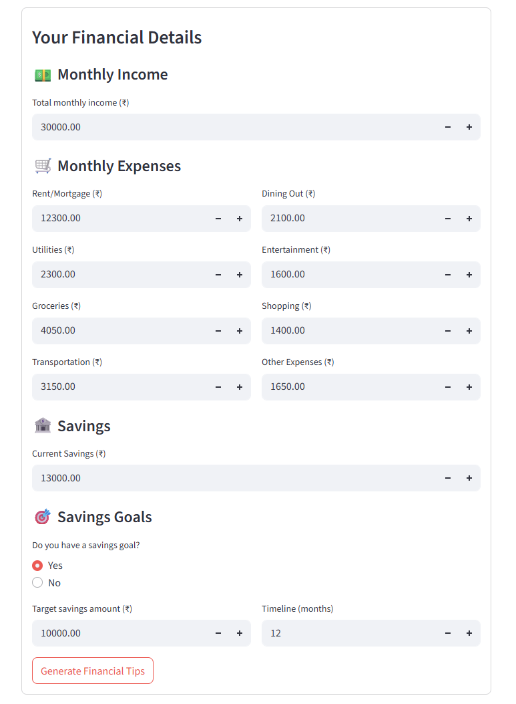
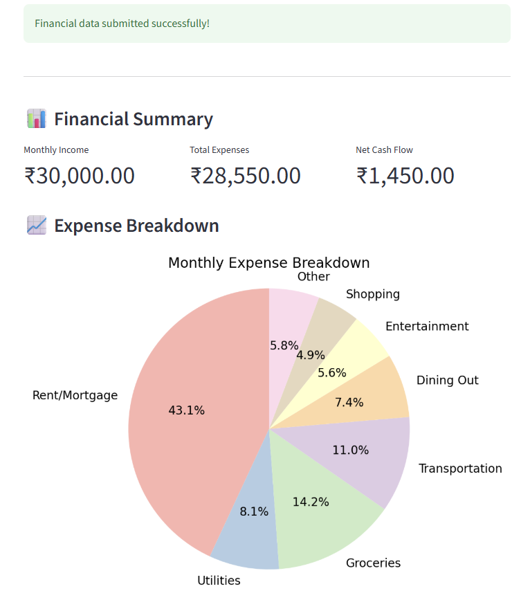

# 💰 MoneyMentor-AI

A Streamlit-powered Gen AI tool that gives you actionable, AI-generated personal finance tips using the Groq API. Built to help users improve their budgeting, saving, and financial awareness with just one click.

---

## 📌 Features

- 🧠 AI-generated tips on saving, budgeting, investing, etc.
- 🔍 Personalized advice based on your income, expenses, and savings goals
- 📊 Visual breakdowns of financial data using Matplotlib
- 🔐 Keeps your data private and local (no server storage)
- ⚡ Built with Groq API for blazing-fast LLM-powered insights

---

## 📸 App Preview

### 🧮 Full Dashboard View  
  
*A clean layout showing form input, financial metrics, and real-time advice using Groq API.*

---

### 📥 Financial Input Form  
  
*Easily input your monthly income, expenses, and savings goals.*

---
### 📊 Financial Summary & Pie Chart  
  
*Visual breakdown of where your money is going each month.*

---

### 🧠 Personalized AI Tips  
  
  
*Get instant financial advice powered by Gen AI + smart logic.*

---

## 🛠️ Tech Stack

- **Python** 🐍  
- **Streamlit** 🎈  
- **Groq LLM API** 🤖  
- **Matplotlib** 📊  
- **Pandas** 🐼  

---

## 🚀 How to Run Locally

```bash
git clone https://github.com/your-username/MoneyMentor-AI.git
cd MoneyMentor-AI
pip install -r requirements.txt
streamlit run finance_groq.py
